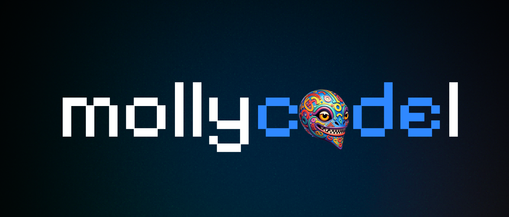

<p align="center">
  
</p>

<p align="center">
  <strong>A code editor with a second window for AI agents.<br>Your providers. Your keys. Your machine.</strong>
</p>

---

mollycodel is a desktop editor built from [Visual Studio Code](https://github.com/microsoft/vscode)'s MIT-licensed source through [VSCodium](https://github.com/VSCodium/vscodium)'s build process, with an **Agents Window** and two coding agents wired in: **Pi** and **OpenCode**. There is no account to create and no GitHub or Copilot sign-in. You bring your own AI providers.

## What's in it

- **An Agents Window.** A full second window (alongside the editor) with a session list across projects and a composer. VS Code ships this layer; mollycodel makes it usable without a Copilot account.
- **Pi, a multi-provider agent.** Runs on [`pi-ai`](https://www.npmjs.com/package/@earendil-works/pi-ai) and [`pi-agent-core`](https://www.npmjs.com/package/@earendil-works/pi-agent-core). It reads and lists files, writes and edits files, and runs shell commands, and **asks for approval before it writes or runs anything**. Reads of `.env` files and `~/.ssh`, `~/.aws` and `~/.gnupg` are blocked outright.
- **A provider manager.** Run **`Pi: Manage Providers`** from the Command Palette. Add any of Pi's 40+ built-in providers, or a custom OpenAI- or Anthropic-compatible endpoint, with live model discovery. **API keys are stored in your operating system keychain**, are never shown again after you save them, and are sent to the agent process in memory only.
- **OpenCode, with your own setup.** If you have [OpenCode](https://opencode.ai) installed, mollycodel runs it as a second agent on a private local server (127.0.0.1, random port, random password). OpenCode reads *your* configuration, so your providers, agents, skills and MCP servers apply as they are. mollycodel never touches OpenCode's keys, and OpenCode is not bundled.
- **Everything VSCodium gives you:** Microsoft's telemetry and tracking endpoints removed, and extensions from [Open VSX](https://open-vsx.org/).

## Status

This is an early, working build. Being straightforward about what it is and isn't:

- **Platform:** built and tested on **macOS, Apple Silicon (arm64)** only. Other platforms are not built.
- **Not notarized.** It is signed ad-hoc, because notarization needs a paid Apple Developer account. See [Install](#install).
- **Known gaps:** subscription logins (Claude Pro/Max, ChatGPT, Grok and others) are listed in the provider dialog but not enabled yet; choosing an OpenCode *agent* such as `plan` from the interface is not wired up yet.
- **Moving a chat** between the editor's side panel and the Agents Window uses VS Code's built-in handoff. It has not yet been verified end to end with these agents.

## Install

No release is published yet, so build the `.dmg` yourself (see [Build from source](#build-from-source)); prebuilt installers will appear on the [Releases](https://github.com/fractalmandala/mollycodel/releases) page. Open the `.dmg` and drag **mollycodel** onto **Applications**.

A copy that reaches your Mac by download or AirDrop is quarantined by macOS because it isn't notarized. Right-click the app and choose **Open** once, or run:

```bash
xattr -cr /Applications/mollycodel.app
```

mollycodel is a separate app from any VSCodium or VS Code you already have: its own bundle ID (`com.fractalmandala.mollycodel`), its own settings and its own extensions folder (`~/.mollycodel`). It starts with a clean profile. On first launch macOS may ask to let it use **"mollycodel Safe Storage"** in your keychain; allow it, since that is where provider keys go. Automatic updates are turned off.

## Build from source

You need macOS on Apple Silicon, the Xcode command line tools, [Node.js](https://nodejs.org/) 24 (see `.nvmrc`), `jq`, `git`, `python3`, a Rust toolchain, and about 20 GB of free disk.

```bash
./dev/build.sh          # fetch Microsoft's source at the pinned tag, apply patches, build the app
./dev/make-dmg.sh       # seal the app and package it as a drag-to-Applications .dmg
```

The first build takes a while (about 20–30 minutes). The app lands in `VSCode-darwin-arm64/mollycodel.app` and the installer in `assets/`. After the first fetch, `./dev/build.sh -s` rebuilds from the existing source tree.

## How it fits together

The editor source is not stored in this repository. `dev/build.sh` fetches Microsoft's `vscode` at the tag pinned in `upstream/stable.json`, applies VSCodium's patches, then applies ours from `patches/user/`:

| Patch | What it does |
| --- | --- |
| `10-sessions-sever-github` | Agents Window opens without a GitHub sign-in; Copilot provider unregistered |
| `20-agenthost-pi-agent` | The Pi and OpenCode agents, provider runtime, tools and approvals |
| `30-chat-enable-ai-features` | AI features enabled by default |
| `40-deps-pi` | Runtime dependencies for Pi (additive lockfile edit) |
| `50-pi-providers-ui` | The providers editor, keychain storage, model picker wiring |

`dev/make-user-patch.py` regenerates a patch containing only our own change. The design, the decisions behind it and the lessons learned are written up in [`docs/agents-window/SPEC.md`](./docs/agents-window/SPEC.md).

## License and attribution

mollycodel stands on other people's open-source work and keeps their terms.

- **This repository** (build scripts, patches, tooling, docs) is [MIT licensed](./LICENSE). The license file carries the original notice, *Copyright (c) 2018-present The VSCodium contributors* and *Peter Squicciarini*, and that notice must stay with any copy.
- **Visual Studio Code's source** is MIT licensed, © Microsoft Corporation. mollycodel is built from that open source with Microsoft's product configuration (telemetry, marketplace and branding endpoints) left out. It is **not Microsoft's distribution of Visual Studio Code** and is not covered by the license of Microsoft's own binaries.
- **Components inside the app** keep their own licenses. The app includes a `ThirdPartyNotices.txt` (in `mollycodel.app/Contents/Resources/app/`).
- **Pi** (`@earendil-works/pi-ai`, `@earendil-works/pi-agent-core`) is MIT licensed and is bundled as a runtime dependency.
- **OpenCode** is a separate program you install yourself, under its own license. It is not bundled or redistributed; mollycodel only talks to it over local HTTP.
- **PI-Desktop** ([vastsa/PI-Desktop](https://github.com/vastsa/PI-Desktop), LGPL-3.0) was read as a design reference. **No code from it is included.**
- **Extensions** come from Open VSX. The Visual Studio Marketplace's [terms of use](https://aka.ms/vsmarketplace-ToU) limit it to Microsoft's own products, so it is not used here, and some extensions restrict themselves to official Visual Studio Code builds and will not work.

**Trademarks and branding.** "Visual Studio Code" and "VS Code" are trademarks of Microsoft. "VSCodium", "OpenCode" and "Pi" belong to their respective projects. mollycodel is not affiliated with, sponsored by or endorsed by Microsoft, the VSCodium project, the OpenCode project or the Pi project. The mollycodel name, mascot icon and wallpaper are this project's branding; the MIT license covers the source files in this repository, not these artwork assets.

## Thanks

- The [VSCodium](https://github.com/VSCodium/vscodium) contributors, whose build process this project is built on.
- [Microsoft and the Visual Studio Code contributors](https://github.com/microsoft/vscode).
- The [Pi](https://github.com/earendil-works/pi) authors, for a library that made a multi-provider agent practical to embed.
- The [OpenCode](https://opencode.ai) team.
- The PI-Desktop author, for a clear picture of what a good provider manager looks like.
